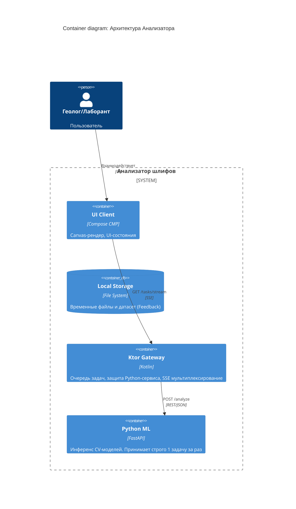

# SYSTEM ARCHITECTURE & DECISIONS
> Version: 4.1

## 1. Контекст и контейнеры

Система работает в закрытом контуре. Внешних зависимостей (баз данных пользователей, IAM, внешних LLM) нет.

## 2. Ключевые системные решения (ADR)

### ADR 1: Защита ML-сервиса (Очередь)
**Контекст:** Панорамные OM-снимки вызывают OOM (Out of Memory) в Python при параллельной обработке.
**Решение:** Python FastAPI работает в 1 поток. Ktor Gateway принимает все удары на себя: сохраняет картинки на диск, кладет в `Channel` (Kotlin) и шлет в Python строго по одной (FIFO).
**Лимиты:** Глобальный лимит очереди (50 задач). Лимит на клиента (10 задач). 

### ADR 2: Stateless идентификация клиентов (Anonymous Sessions)
**Решение:** При старте UI генерирует UUID (Client-Id). Каждый запрос содержит заголовок `X-Client-Id`. Ktor не хранит сессии, он привязывает этот ID к задачам в очереди и отдает в SSE-стрим только "свои" события.

### ADR 3: Отказ от принудительной отмены в ML-сервисе
**Решение:** Ktor помечает задачу как "Отменена" и удаляет из памяти. Питон доделывает работу вхолостую (защита от гонок состояний / Race Condition).

### ADR 4: Отказ от KRPC
**Решение:** Используем REST + Ktor Client + SSE. KRPC конфликтует с Compose-плагинами и усложняет дебаг.

### ADR 5: Формат хранения датасета (Feedback Data)
**Контекст:** Как связывать картинку и метаданные разметки без реляционной базы данных (СУБД)?
**Решение:** Использовать индустриальный стандарт сырых CV-датасетов — **Paired Files (Парные файлы)**. 
На каждое исправление Ktor пишет в Docker Volume `/dataset/feedback` два файла с одинаковым именем:
1. `8f3b2a-11c... .tiff` (сама картинка)
2. `8f3b2a-11c... .json` (метаданные)
В самом JSON дополнительно прописано поле `"image_filename": "8f3b2a-11c... .tiff"`.
**Почему не БД:** Для сбора сырого датасета под ML-обучение база данных — это оверинжиниринг (нужны миграции, ORM). Датасаентистам всегда удобнее скриптом читать папку с JSON+TIFF парами, чем делать дампы из PostgreSQL.
